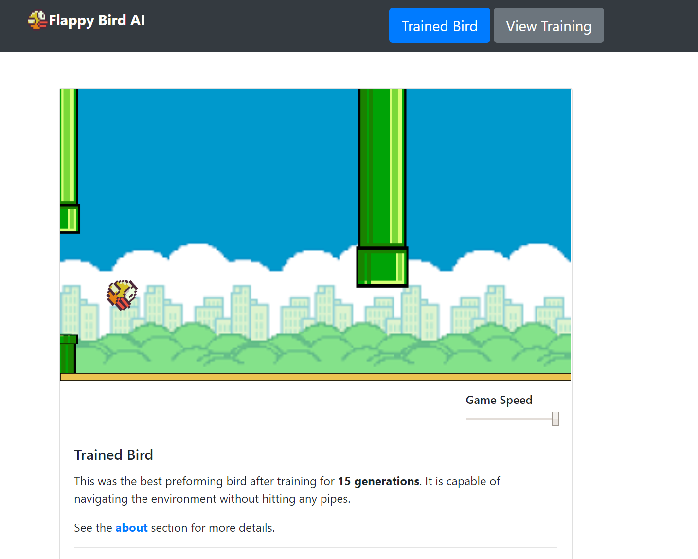

# FlappyBird_AI

## Live site
__https://flappybird-ai.netlify.app__

## Screenshot


## About
This AI was trained using __N.E.A.T.__ This is a genetic algorithm that trains the AI by creating generations of agents and simulating them in a environment. Each bird has a Neural Network that will decide to make the bird flap based on its inputs. The birds with the best Neural Networks are selected for the next generation and slightly mutated to create new behavior.

This project was made using __P5js__ to render the game and __TensorFlow__ js to create the Neural Networks.

## Run Local
Download the code and navigate to this directory.
```
git clone https://github.com/SeanFitz1997/FlappyBird_AI.git
cd FlappyBird_AI
```
Run a __python server__ and open the __index.html__ file.
```
$ python -m http.server
Serving HTTP on 0.0.0.0 port 8000 (http://0.0.0.0:8000/) ...
```

## Whats here
- data (Contains trained model)
- images (Contains game and website images)
- src (Contains code for Flappy Bird AI)
    - main.js (setup and draw loop)
    - Environment.js (render and move environment)
    - Ground.js (render ground)
    - Pipe.js (render and move pipe)
    - Population.js (render and move population of birds)
    - Bird.js (render and make actions using Neural network)
    - Brain.js (create Neural network and make prediction)
    - Neuroevolution.js (evaluate and create next generation)
- index.html (webpage)
- index.js (handles webpage interactions)
